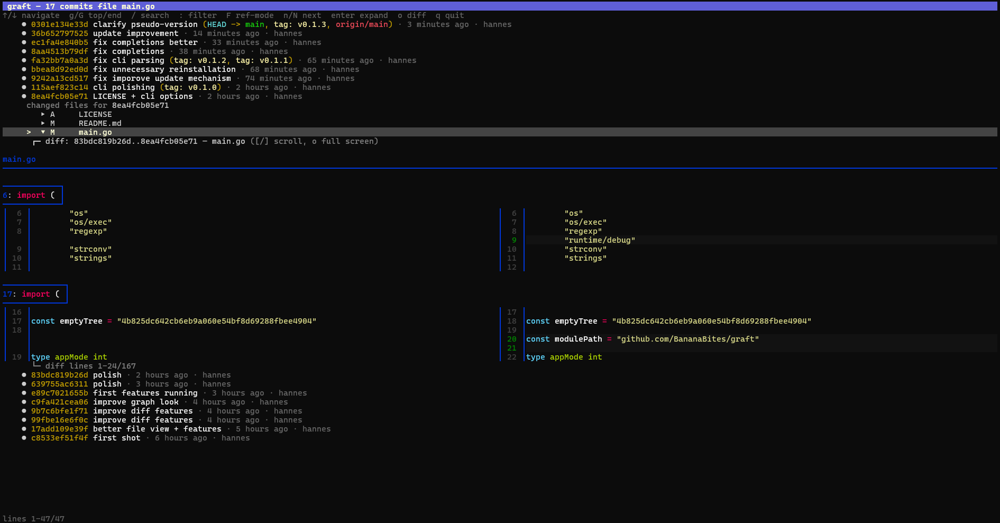

# graft

A read-first, graph-first terminal Git navigator inspired by Git Graph.



## Features

- Full-terminal `git log --graph` view with graph connector colors, stable branch identity colors, refs, subjects, relative time, and author.
- Composable graph filters for message, branch, tag, author, and path.
- Fuzzy branch/tag completion in filter mode.
- Vim-style graph search with `/`, `n`, and `N`.
- Keyboard and mouse commit navigation.
- `Enter`/click a commit to expand changed files inline.
- `Enter`/click a file to expand an inline side-by-side diff below it.
- `Shift-J` / `Shift-K`, `Shift-Down` / `Shift-Up`, `PgUp` / `PgDn`, or mouse wheel over the diff scrolls the inline diff.
- `o` opens the selected file diff in a full-screen internal diff view.
- `f` in full-screen diff toggles between changed hunks and full-file context.
- Full-file diff mode shows a horizontal change minimap with viewport position and add/delete/modify markers.
- `W` in full-screen diff toggles whitespace-error highlighting.
- `Shift-J` / `Shift-K` in full-screen diff jumps between change occurrences.
- `Esc` returns from full-screen diff to the graph.
- `c` on two commits compares `A..B` and shows changed files/diffs for that range.

## Requirements

- Rust/Cargo for building from source
- `git`
- [`delta`](https://github.com/dandavison/delta) for side-by-side diffs

If `delta` is missing, graft falls back to a unified `git diff`.

## Install from source

```sh
cargo install --path .
```

Or build an optimized local binary:

```sh
cargo build --release
./target/release/graft
```

When the public repository is available, graft can also be installed directly from GitHub:

```sh
cargo install --git https://github.com/BananaBites/graft graft
```

## Usage

Run `graft` inside a Git repository:

```sh
graft
```

Or start in a specific repository/path:

```sh
graft /path/to/repo
```

Useful command-line options:

```sh
graft --version
graft --completion bash

# delta theme/syntax-theme helpers
graft --show-delta-themes
graft --list-delta-syntax-themes
graft --delta-theme colibri
graft --delta-syntax-theme GitHub --delta-light
```

### Delta themes and persistent config

Diff rendering is powered by `delta`, so graft can pass through delta themes and syntax themes:

```sh
graft --delta-theme colibri              # delta feature/theme
graft --delta-syntax-theme GitHub        # syntax highlighting theme
graft --delta-syntax-theme GitHub --delta-light
graft --delta-dark
```

`--delta-theme <name>` auto-detects built-in syntax themes such as `GitHub`; for clarity you can use `--delta-syntax-theme <name>` explicitly.

To persist the current theming options, add `--save-config`:

```sh
graft --delta-syntax-theme GitHub --delta-light --save-config
```

This writes a small config file and exits. The path is printed, for example:

```text
wrote config: /home/alice/.config/graft/config
delete this file to reset, or edit it manually
```

The config location follows the platform user config directory:

- Linux: `$XDG_CONFIG_HOME/graft/config` or `~/.config/graft/config`
- macOS: `~/Library/Application Support/graft/config`
- Windows: `%AppData%\graft\config`

Command-line theme options override saved config values.

## Filtering

Press `:` to enter filter mode. Filters are composable; each accepted filter narrows the graph further.

```text
:fix bug          # default: commit message grep
:msg fix bug
:branch main     # fuzzy-completes branches with Tab
:tag v1.0        # fuzzy-completes tags with Tab
:author hannes
:path src/main.rs
:pop             # remove last filter
:clear           # clear all filters
```

`F` toggles branch/tag filters between:

- `history`: show commits reachable from the branch/tag
- `decor`: match branch/tag names in rendered decorations

Press `/` for a lightweight search within the currently visible graph, then `n` / `N` for next/previous match.

## Full-screen diff

Press `o` on a selected file to open the full-screen diff.

- `f` toggles between hunk-only and full-file context.
- In full-file mode, a `map` line below the diff shows change locations across the file:
  - green = additions
  - red = deletions
  - yellow = modifications or mixed changes
  - solid bar = current viewport, colored when it overlaps a change
- `Shift-J` / `Shift-K` jumps between change occurrences.
- `W` toggles delta whitespace-error highlighting, useful for spotting trailing whitespace and other whitespace-only changes.

## Comparing commits

1. Move to the first commit and press `c` to mark compare A.
2. Move to the second commit and press `c` to mark compare B.
3. The inline file list shows changes for `A..B`.
4. Open a file with `Enter`, or press `o` for full-screen diff.

## Keys

| Key | Action |
| --- | --- |
| `↑/↓`, `k/j` | Navigate commits/files; scroll full-screen diff |
| `g` / `G` | Jump to top / bottom in graph and full-screen diff |
| `/` | Search visible graph text; `n`/`N` jump next/previous |
| `:` | Add graph filter: `branch main`, `tag v1`, `msg fix`, `author name`, `path file` |
| `Tab` | Complete branch/tag while entering a filter |
| `F` | Toggle branch/tag filters between history mode and decoration-match mode |
| `Enter`, `Space`, click | Expand commit or file |
| `Shift-J` / `Shift-K`, `Shift-Down` / `Shift-Up`, `PgUp` / `PgDn` | Scroll inline diff |
| `o` | Open selected file diff full-screen |
| `f` | Toggle full-screen diff between hunks and full file |
| `W` | Toggle whitespace-error highlighting in full-screen diff |
| `Shift-J` / `Shift-K`, `Shift-Down` / `Shift-Up` | Jump between changes in full-screen diff |
| `Esc` | Back out / return from full diff |
| `c` | Mark compare commit A, then B |
| `x` | Clear compare |
| `r` | Reload graph |
| `:clear` | Clear graph filters |
| `:pop` | Remove last graph filter |
| `q`, `Ctrl-C` | Quit |

## Development

```sh
make run ARGS="/path/to/repo"
make test
make check
make release
make install
```

See `Makefile` for the small set of development commands.

## License

MIT
